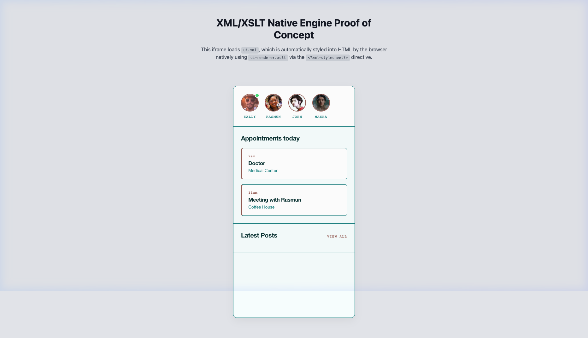

# XML-XSLT UI Generation Pipeline for AI

This repository demonstrates a powerful, deterministic pipeline for getting AI Agents to accurately generate and iterate on User Interfaces without breaking styling.

## The Problem
When asking an AI to design or modify a UI using raw HTML and CSS (especially with complex design systems or grid frameworks), the AI often breaks the layout. HTML and CSS are structurally flexible and visually ambiguous to an AI, meaning it's hard for the model to perfectly "see" how its code maps to the visual output, leading to cascading layout errors during iteration.

## The Inspiration
This method is based on an insight from [Mark Essien's tweet](https://x.com/markessien/status/2028716745150673334?s=61):

> "This is incredible. It looks like a simple screenshot of an app, but it's not. It's XML with XSLT, an almost deprecated technology, but this is how you can get AI to *see* how your pages look... I made it first general a bunch of XML files fully describing the UI and what it sees in there. XML is deterministic - it's not like CSS or HTML... And I found out today that there is this old tech called XSLT that allows you render the XML in a browser, so you can also view it."

## The Solution
Instead of forcing the AI to write HTML/CSS, we ask it to generate **XML**. XML is strict, formal, and highly deterministic. We then map those logical XML elements to our complex HTML/CSS rules using an **XSLT** (eXtensible Stylesheet Language Transformations) file.

### How it Works
1. **Define the structure in XML**: The AI writes highly logical representations of the data and structure (e.g. `<AvatarRow>`, `<Card time="9am">`).
2. **Link the XSLT Renderer**: The XML file includes an `<?xml-stylesheet?>` directive pointing to `ui-renderer.xslt`.
3. **Native Browser Transformation**: When you open the XML file in a browser, the browser's native engine applies the XSLT stylesheet and perfectly renders the intended HTML/CSS UI in real-time.

### Benefits
- **Perfect AI Iteration**: The AI can now iterate strictly on the deterministic XML data structure (e.g., adding a new `<User>`) without ever touching, and risking breaking, the CSS grid or design tokens.
- **Formal Verification**: Once the logical XML structure is perfected through iteration, you can then (if you choose) formalize the adoption into your actual frontend code (React, Vue, etc).

## Demo

This repository contains a simple Proof-of-Concept.

### Included Files
*   `ui.xml`: The strict, AI-friendly UI representation.
*   `ui-renderer.xslt`: The stylesheet mapping the custom XML tags into standard HTML and modern CSS (using Inter font and basic design tokens).
*   `preview.html`: A simple wrapper iframe to view the result, simulating an app view.

### How to Run
1. Clone this repository.
2. Start a simple local web server in the directory (e.g., `python3 -m http.server`). *Note: Opening the local file directly via `file://` may be blocked by modern browser CORS constraints for loading the external XSLT file.*
3. Open `http://localhost:8000/preview.html` or `http://localhost:8000/ui.xml` in your browser.

## License
MIT
